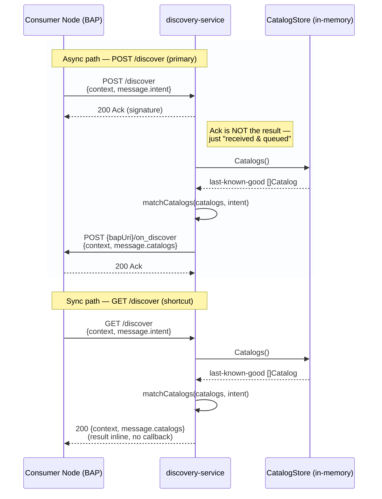
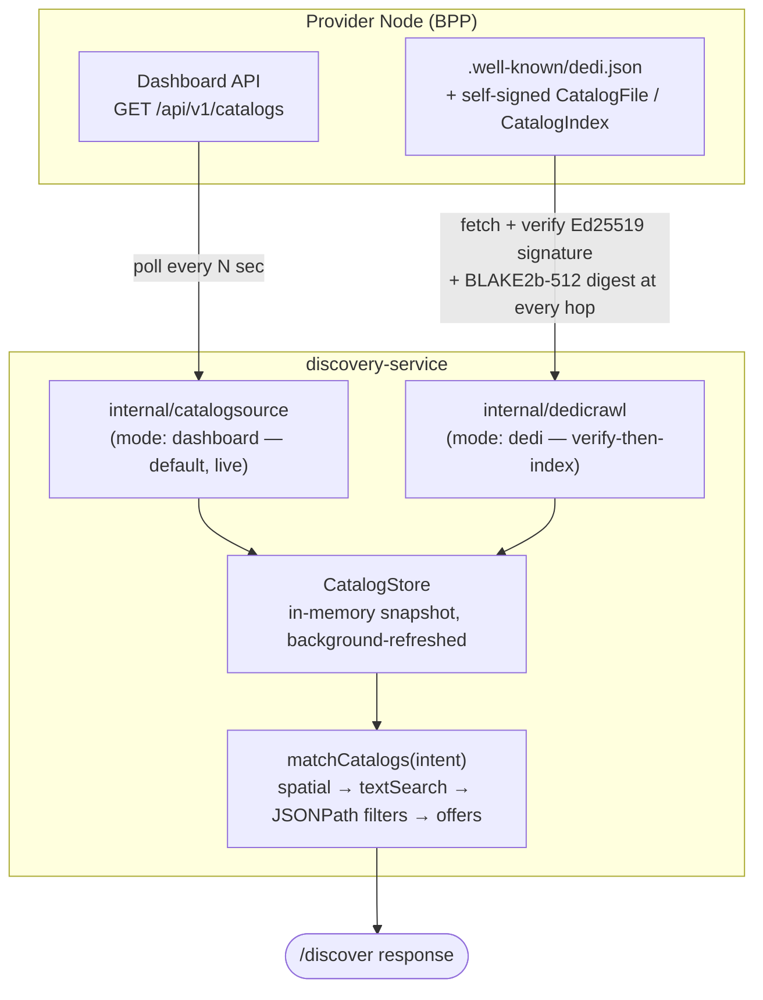

# discovery-service

A Go implementation of a Beckn **Discovery Service (DS)**: it serves
`POST /discover` requests and answers them asynchronously via
`POST /on_discover` to the caller's callback URL, per Beckn Protocol v2.0.0.

See [CONTEXT.md](CONTEXT.md) for the full architecture, decision log, and
protocol details.

## How it works

### 1. Answering a `/discover` request

A Consumer Node (BAP) asks for products/services; this service matches its
already-indexed catalog data against the request's `message.intent` and
answers either synchronously (`GET /discover`) or asynchronously via a
callback (`POST /discover` → `POST {bapUri}/on_discover`).



A malformed `filters` expression is rejected with `400` at the `Ack`/response
stage itself — never discovered later inside a background job with no way
to report it back.

### 2. How a product actually gets indexed, and how intent narrows it down

`CatalogStore` is fed by one of two interchangeable sources
(`CATALOG_SOURCE_MODE`), and every query is narrowed by `matchCatalogs`
against whatever that store currently holds:



- **`dashboard` mode** (default, what's actually running today): polls a
  BPP's existing internal dashboard API — a stopgap, not a signed/versioned
  Beckn contract (CONTEXT.md D17).
- **`dedi` mode** (opt-in): crawls a Provider Node's self-hosted, Ed25519-signed
  catalog files per `protocol-specifications-v2` §10 — verifying a signature
  or digest at every hop before trusting anything (CONTEXT.md D18). No real
  DeDi registry is reachable yet, so this mode currently only has data to
  serve from a checked-in dev fixture.
- **Matching** (`internal/service/match.go`, CONTEXT.md D19): a catalog
  survives only if it passes every spatial constraint, then its resources
  are narrowed by `textSearch` and/or a JSONPath `filters` expression, and
  its offers are dropped if they only referenced a now-excluded resource. A
  catalog left with nothing at all is excluded from the result.

## Quickstart

```bash
cp .env.example .env
docker compose up --build
```

The service listens on `HOST_PORT` (see `.env`), forwarded to `PORT` inside
the container.

## Development

```bash
go build ./...
go vet ./...
go test ./...
```

Run locally without Docker:

```bash
go run ./cmd/discovery
```
